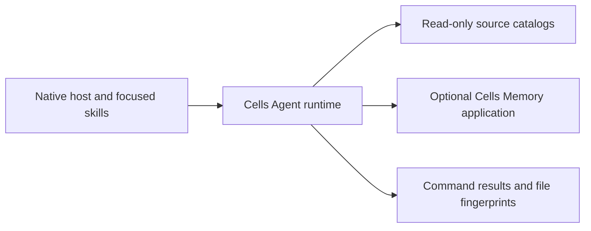

# Cells Agent Bundle 3

A local toolkit for BBVA Cells development with native Codex, VS Code Copilot and OpenCode agents. Version 3 adds an executable Python core, source-backed SQLite catalogs, optional project memory and reproducible command evidence.

## What it does

- Detects Cells from actual project manifests and scripts.
- Resolves existing package commands, including the documented `cells component:*` family and verified legacy `cells lit-component:*` scripts.
- Searches 106 Spherica packages and 118 official documents offline, returning previews before full APIs.
- Records real check results against working-file fingerprints and identifies stale evidence after edits.
- Connects to the independently installed Cells Memory application for explicit project notes and migration.
- Uses native host agents and permissions; small tasks stay direct.



Memory, workflow documents and test evidence have separate purposes. No Engram service, model API key or Python package installation is required by the core. The host supplies model access.

## Start locally

Python 3.11+ with SQLite FTS5 is the supported complete-toolchain baseline. Node.js is also required for native hook adapters.

```sh
python3 runtime/cells-agent.py doctor
python3 runtime/cells-agent.py --root /path/to/cells-project project
python3 runtime/cells-agent.py --root /path/to/cells-project resolve test
python3 runtime/cells-agent.py search components bbva-button-default --limit 1
python3 runtime/cells-agent.py search docs "component test" --limit 3
```

Commands print JSON. Use `--help` for each subcommand. The executable is called **Cells Agent** and does not replace BBVA's `cells` CLI.

## Install

Inspect a concrete installation plan, then apply it:

```sh
python3 scripts/install.py --agent vscode --path /path/to/project --dry-run
python3 scripts/install.py --agent vscode --path /path/to/project
```

For global Codex or OpenCode assets:

```sh
python3 scripts/install.py --agent codex --profile single --dry-run
python3 scripts/install.py --agent opencode --dry-run
```

Remove `--dry-run` to install the selected bundle. Existing files that conflict with managed versions are preserved and listed. `--replace` explicitly backs up and replaces conflicting bundle files after inspection. Unrelated files are kept; installing never migrates memory. Bash and PowerShell wrappers use the same installer.

The historical `setup.sh` and `setup.ps1` entrypoints also use this installer and its options.

All hosts default to `--profile single`; select `--profile multi` for the three bounded specialist roles. Other targets are `project-local`, `all-global`, and `custom --path <bundle-root>`. Custom installation puts skills, runtime, adapters and documentation inside that root. For manual deployment [build host packages from source](docs/harness.md). Host trust, account access and enabling customizations remain native host steps.

## Optional memory

```sh
python3 runtime/cells-agent.py --root /path/to/project memory search "locale setup"
python3 runtime/cells-agent.py --root /path/to/project memory save --title "Locale source" --content "The component uses locales/locales.json." --topic-key locale-source
python3 runtime/cells-agent.py --root /path/to/project memory context --limit 3
```

Install [Cells Memory](https://github.com/PixelDroid19/cells-memory) first; this private repository requires collaborator access. Notes stay in its user-local SQLite database. Every operation has an explicit or root-derived project namespace. No prompts or tool streams are captured automatically. Read [memory semantics and migration limits](docs/memory.md) before importing an Engram JSON export. The native MCP server exposes read tools by default; add `--memory-write` to expose explicit saves.

## Architecture and guidance

- [Runtime commands and host setup](docs/runtime.md)
- [Architecture and boundaries](docs/architecture.md)
- [Upstream research and source decisions](docs/upstream-design-notes.md)
- [Local validation results and remaining boundaries](docs/validation-v3.md)
- [Skills index](AGENTS.md)
- [Work sizing](skills/_shared/cells-work-sizing-contract.md)
- [Source routing](skills/_shared/cells-source-routing-contract.md)

`runtime/` is the executable core. `adapters/hosts.json` declares role capabilities; `scripts/generate_adapters.py` renders native source configurations. `skills/` contains focused guidance and source catalogs. `examples/` contains native host projections. `portable/` and `dist/` are ignored build outputs; generated copies are not tracked.

## Development and verification

```sh
PYTHONDONTWRITEBYTECODE=1 PYTHONPATH=runtime python3 -m unittest discover -s tests -v
python3 scripts/generate_adapters.py --check
python3 scripts/validate_skill_quality.py
python3 scripts/validate_governance_behavior.py
python3 scripts/validate_component_catalog.py
python3 scripts/validate_official_docs_catalog.py
bash scripts/install_test.sh
python3 scripts/bundle.py all
python3 scripts/validate_bundle_parity.py
```

Tests execute real temporary CLI, MCP, command and hook processes, including installs with spaces in their paths. Catalog checks compare hashes and ZIP bytes. Native adapter checks verify capabilities and external-workspace hook execution. These are contract tests; they do not prove an authenticated model session in a particular host or end-to-end application UI behavior.

## Version 3 changes

The Engram dependency is replaced with optional local memory and explicit migration. Codex exposes individual skills directly instead of hiding them behind one cache gateway. VS Code subagents are invocable and prompts inherit their agent tools. Standalone hooks use the plugin root. The unmanaged OpenCode background delegation engine is retired. Installers preserve conflicts and support dry-run/backup workflows. Search rejects invalid queries, validates packaged indexes and returns bounded previews.

The original implementation draws architectural ideas from [gentle-pi](https://github.com/Gentleman-Programming/gentle-pi), [gentle-ai](https://github.com/Gentleman-Programming/gentle-ai), and [Engram](https://github.com/Gentleman-Programming/engram), without copying their engines. See the pinned source decisions above. BBVA source snapshots are preserved in the catalog manifests; verify actual installed component versions before applying their APIs.
