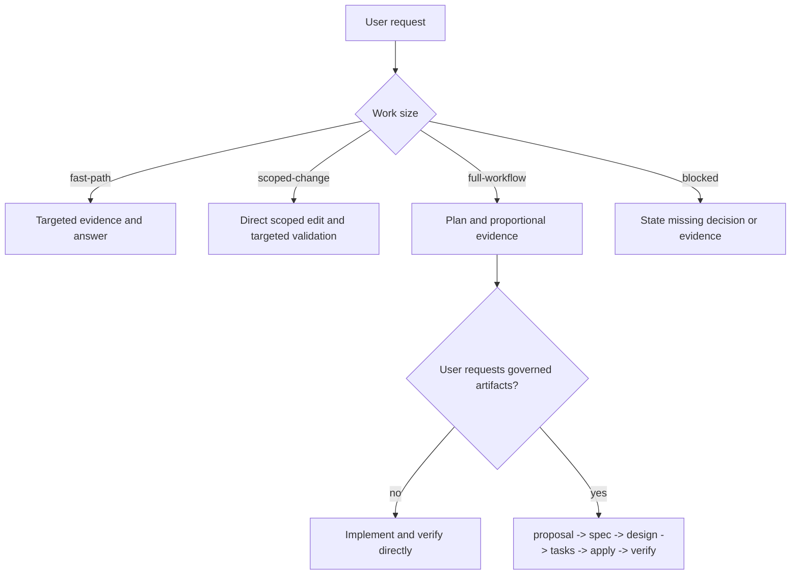

# Cells Agent Bundle Architecture

Cells Agent Bundle combines a small local runtime with offline Cells knowledge and focused workflow guidance. It helps an agent make evidence-based Cells decisions without requiring a cloud service, an Engram integration, or a mandatory multi-agent workflow.

## Four Layers

```text
Host adapters
    Native agent roles, permissions, and optional MCP/command entry points
        ↓
Runtime
    runtime/cells-agent.py: project detection, command resolution,
    policy, evidence, catalog search, and optional memory commands
        ↓
Skills and catalogs
    Cells rules, workflow guidance, SQLite/FTS5 component and official-doc catalogs
        ↓
Workspace and optional persistence
    Project source and scripts; optional OpenSpec artifacts; separate LocalMemory data
```

### Host adapters

Host configuration is a thin adapter over native agent capabilities. It can route a task to a specialist or expose the runtime, but it does not create a separate background-delegation engine or change host permissions. Delegation is useful for independent full-workflow work; an orchestrator can perform a scoped change directly and integrates any delegated results.

### Runtime

`runtime/cells-agent.py` is a Python standard-library command-line entry point. It keeps executable decisions close to the workspace:

- `doctor` checks the local bundle/runtime environment.
- `project` detects actual BBVA Cells markers and project conventions.
- `resolve` maps a requested intent to a verified installed project script; skills map that result to a documented Cells command family when useful.
- `policy` and `check` evaluate commands and local prerequisites without treating arbitrary prose as an executable command.
- `evidence` records command outcomes and source fingerprints separately from memory.
- `search` queries the bundled catalogs with bounded results.
- `memory` exposes explicit `search`, `get`, `save`, `context`, `export`, and `import-engram` operations when the independent Cells Memory executable is installed.
- `mcp` is an optional stdio entry point for hosts that support it.

The runtime does not claim that a command, component API, or UI works merely because a process stayed alive. Verification uses the observed command exit status and source fingerprints; user-visible claims need the appropriate runtime or browser evidence.

### Skills and catalogs

Skills provide guidance on demand. The shared contracts choose work size, preserve BBVA UI/i18n/public-behavior rules, route evidence, and define status meanings. They do not require a proposal, registry write, memory lookup, or every specialist skill before a direct edit.

Catalog search is primary for bundled Cells knowledge:

| Decision | Primary source | Local confirmation/fallback |
| --- | --- | --- |
| Component selection and package API | Component catalog | CEM, installed package source, project code/tests |
| Framework, CLI, testing, i18n, architecture | Official docs catalog | Project code/CEM/tests, then component detail as needed |
| Executable command | Installed project scripts through resolver | Official documented equivalent and an explicit gap if none resolves |

The documented component command family is `cells component:*`. An installed legacy `cells lit-component:*` script is still a valid local compatibility route when the resolver verifies it. This distinction is grounded in the bundled official catalog guidance and the local legacy command reference at `skills/cells-cli-usage/references/commands.md`.

### Workspace and optional persistence

The user's request authorizes directly scoped source edits. Workflow persistence does not change that authority:

- `artifact_persistence: none` keeps plans and evidence in the current result.
- `artifact_persistence: openspec` stores user-requested governed artifacts under `openspec/`.
- Cells Memory is an independently installed application with an optional local SQLite store with explicit project scope. It is separate from workflow artifacts and verification evidence.

No data is captured to LocalMemory automatically. Imported legacy memories are reference material, not proof. `engram` and `hybrid` are deprecated migration settings; `cells-agent memory import-engram` is explicit and opt-in. See [memory.md](memory.md).

## Workflow Selection



The governed chain is optional. When selected, `spec` precedes `design` and `design` precedes `tasks`. A missing governed artifact blocks that selected phase, not a separately authorized narrow source change.

## Evidence and Status

Workflow results use three statuses:

| Status | Meaning |
| --- | --- |
| `success` | Requested scope is complete and evidence supports the stated result. |
| `partial` | Useful work completed with a concrete evidence or acceptance gap. |
| `blocked` | Safe progress needs an unavailable decision, permission, environment, or out-of-scope change. |

Catalog tools may return `ok` for a successful query. That is a catalog result, not a workflow completion claim.

For UI work, follow the Cells rules: reuse BBVA components first, register custom elements in `scopedElements`, preserve the project's `WidgetMixin`/data-manager architecture, route component-owned visible text through `this.t(...)`, and use the project’s actual locale source. Browser snapshots or screenshots supplement source and test evidence whenever they are needed to prove rendered behavior.

## Boundaries

- The bundle does not install dependencies or use generic test runners merely to make a command work.
- It does not create OpenSpec files, registry entries, or LocalMemory records for questions or direct scoped work unless the user requests that persistence.
- It does not make external issue, PR, push, merge, or publication actions without explicit user authorization.
- It does not replace active project conventions with a bundle heuristic.

## Independent memory package

The storage engine lives in the private `PixelDroid19/cells-memory` repository, with its own installer, package version, tests and MCP server. This repository contains only a subprocess JSON adapter (`runtime/cells_agent/memory.py`); it has no database implementation or direct private-package dependency. Commands and catalogs remain usable when memory is absent. Default memory paths and project identities agree between the two applications.
